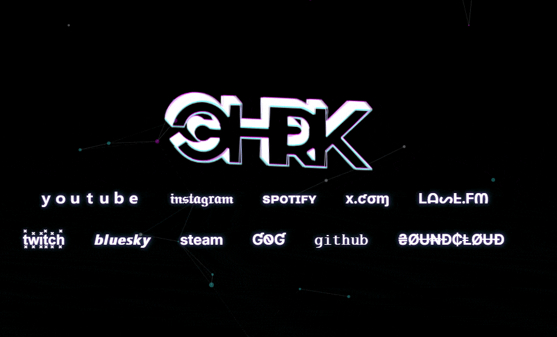

# chrk Bio Page
This is a personal bio page built with modern web technologies.

## Demo

Demo available at https://bio.chrk.tk

## Dependencies

- **React**: A JavaScript library for building user interfaces.
- **React DOM**: A package that provides DOM-specific methods for React.
- **Babel**: A JavaScript compiler that allows you to use next-generation JavaScript.
- **Tailwind CSS**: A utility-first CSS framework for rapid UI development.
- **Google Fonts**: Used for the "Inter" font.

## Credits

Special thanks to GitHub Copilot and Websim.ai for their valuable assistance in the development of this project.

## License

This project is licensed under the MIT License. Feel free to fork and modify it as you like.